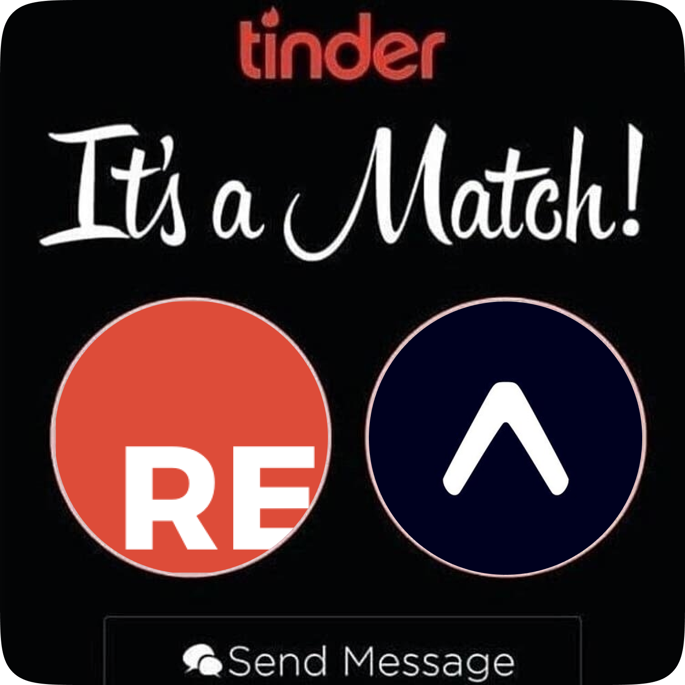

  

<h3 align="center" style="font-weight:600">
  reason-expo
</h3>

  <a href="https://reasonml.github.io/">ReasonML</a> bindings for <a href="https://expo.io">Expo</a>

---

## Getting started

Let's assume that you already
have an Expo project set up. If not, [get Expo running](https://expo.io/learn) and then come back after finished. We'll be happily waiting ☺️

Next, follow [this guide](https://medium.com/@peterpme/your-first-reasonml-pr-into-an-existing-react-native-codebase-a490b4a79649) by [Peter Piekarczyk](https://twitter.com/peterpme) on getting ReasonML set up in a React Native app.

Once completed, `yarn add reason-expo`, and add `"reason-expo"` to your `bs-dependencies` array in `bsconfig.json`. Now get coding!

## Disclaimer

These bindings are targeted to Expo SDK 25. There are some components and APIs missing/in-development. You can find an overview of the completed APIs [here](./STATUS.md). Contributing new Components and APIs are extremely encouraged!

## Contributing

Check out the missing APIs you want to implement [here](./STATUS.md). Then, fork and run `yarn install-peers && yarn start` and start hacking away!

_Credit: This project is based on the work started in [`bs-expo`](https://github.com/fxfactorial/bs-expo/)._
